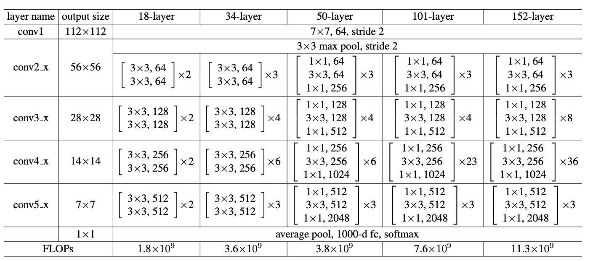
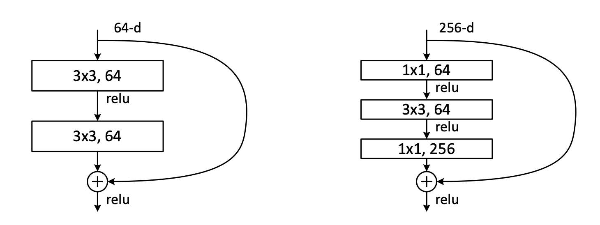
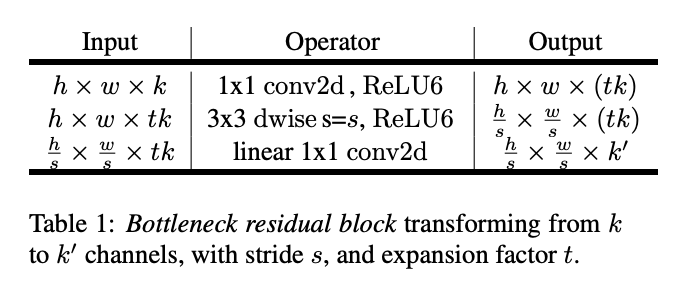
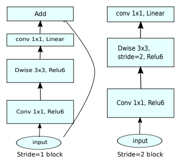
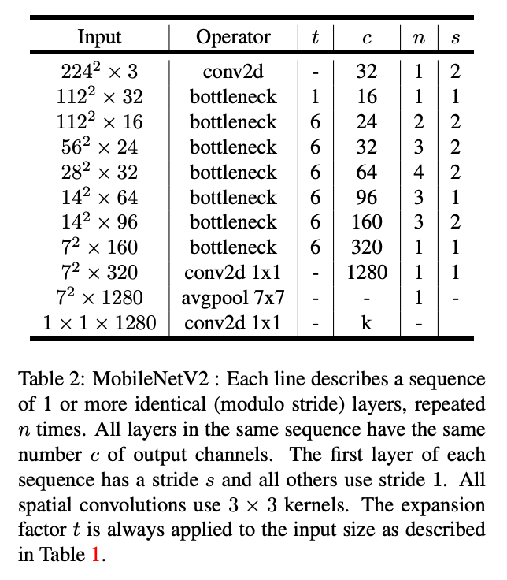
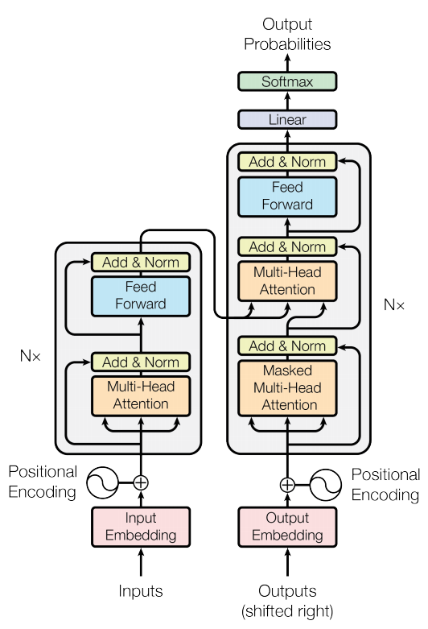
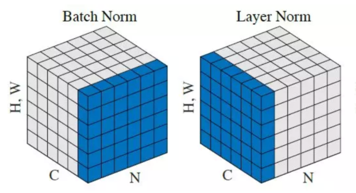
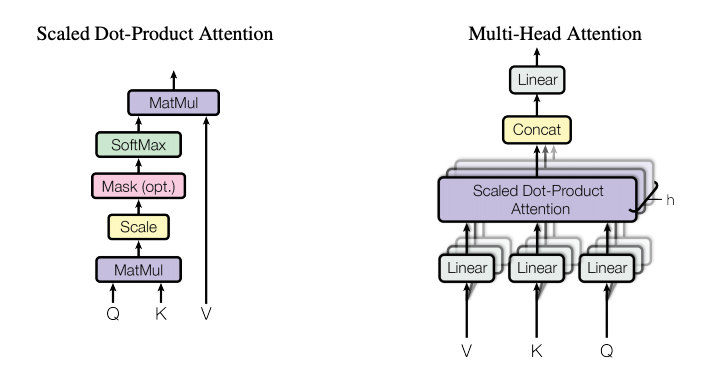
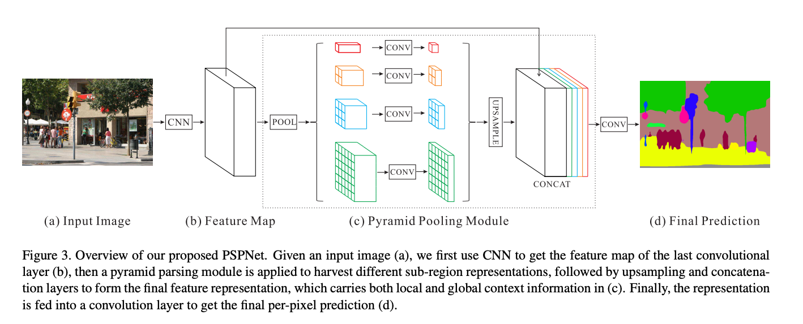

# Resnet



Paper: [Deep Residual Learning for Image Recognition](https://arxiv.org/pdf/1512.03385.pdf)

Sources:

- [Official in torchvision v0.9.0](https://github.com/pytorch/vision/blob/v0.9.0/torchvision/models/resnet.py)

- [Re-implemented by Nivida](https://github.com/NVIDIA/semantic-segmentation/blob/main/network/Resnet.py)

Architecture:

- [BasicBlock](https://github.com/pytorch/vision/blob/v0.9.0/torchvision/models/resnet.py#L37-L83)
    > Conv3x3 + BN + Relu<br>
    > Conv3x3 + BN <br>
    > Add *Res (w or w/o downsample)* <br>
    > Relu
- [BottleNeck](https://github.com/pytorch/vision/blob/v0.9.0/torchvision/models/resnet.py#L86-L141)
    > Conv1x1 + BN + Relu<br>
    > Conv3x3 + BN + Relu<br>
    > Conv1x1 (expanded by 4) + BN<br>
    > Add *Res (w or w/o downsample)*<br>
    > Relu

    

- [Global Module](https://github.com/pytorch/vision/blob/v0.9.0/torchvision/models/resnet.py#L144-L249)
    > Conv7x7 + BN + Relu + MaxPool<br>
    > Layer1 + Layer2 + Layer3 + Layer4<br>
    > AvePool + Flatten + FC<br>
    > <br>
    > *Note: each layer contains different number of blocks (either ``BasicBlock`` or ``BottleNeck``)*

Variations:

- Resnet18: 
    > `BasicBlock`: [2, 2, 2, 2]

- Resnet34:
    > `BasicBlock`: [3, 4, 6, 3]

- Resnet50:
    > `BottleNeck`: [3, 4, 6, 3]

- Resnet101:
    > `BottleNeck`: [3, 4, 23, 3]

- Resnet152:
    > `Bottleneck`: [3, 8, 36, 3]

# Mobilenet

Papers:
- [MobileNets: Efficient Convolutional Neural Networks for Mobile Vision Applications](https://arxiv.org/pdf/1704.04861.pdf)
- [MobileNetV2: Inverted Residuals and Linear Bottlenecks](https://arxiv.org/pdf/1801.04381.pdf)
- [Searching for MobileNetV3](https://arxiv.org/pdf/1905.02244.pdf)

Sources:
- Official in torchvision v0.9.0: [v2](https://github.com/pytorch/vision/blob/v0.9.0/torchvision/models/mobilenetv2.py), [v3](https://github.com/pytorch/vision/blob/v0.9.0/torchvision/models/mobilenetv3.py)

Architecture:

- [ConvBNActivation/ConvBNReLU](https://github.com/pytorch/vision/blob/v0.9.0/torchvision/models/mobilenetv2.py#L31-L54)
    > Conv3x3 + BN + Relu6

- [InvertedResidual](https://github.com/pytorch/vision/blob/v0.9.0/torchvision/models/mobilenetv2.py#L61-L99)
    > ConvBNReLU: 1x1 kernal, *only used if `expansion ratio` not 1*<br>
    > ConvBNReLU: depthwise convolution, i.e. # of input channels == # of output channels<br>
    > Conv1x1 + BN: linear bottleneck (no ReLu layer) & pointwise convolution (1x1 kernal)<br>
    > Add *Res*: inverted, connects bottlenecks as oppose to high number channels

    

    

- [Main Class](https://github.com/pytorch/vision/blob/v0.9.0/torchvision/models/mobilenetv2.py#L102-L198) 
    > ConvBNReLU: regular layer<br>
    > **InvertedResidual (x 7)**: see bottleneck operators in the figure below<br>
    > ConvBNReLU: 1x1 kernal<br>
    > adaptive average pooling 2D + flatten<br>
    > Classifier: dropout + linear<br>

    

# Transformer

Papers:

- [BERT: Pre-training of Deep Bidirectional Transformers for Language Understanding](https://arxiv.org/pdf/1810.04805.pdf)
- [Attention Is All You Need](https://arxiv.org/pdf/1706.03762.pdf)

Sources:

- [Official in pytorch v1.8.0](https://github.com/pytorch/pytorch/blob/v1.8.0/torch/nn/modules/transformer.py)

Architecture:
- [Transformer (Main)](https://github.com/pytorch/pytorch/blob/v1.8.0/torch/nn/modules/transformer.py#L16-L142)
    > TransformerEncoder
    > - input: `src` (S, N, E)
    > - output: `memory` (S, N, E)
    >
    > TransformerDecoder
    > - input: `tgt` (T, N, E) & `memory` (S, N, E)
    > - output: `output` (T, N, E)
    >
    > Parameters:<br>
    > `d_model`: the number of expected features in the encoder/decoder inputs (default=512), or `E`<br>
    > `nhead`: the number of heads in the multiheadattention models (default=8)<br>
    > `num_encoder_layers`: the number of sub-encoder-layers in the encoder (default=6)<br>
    > `num_decoder_layers`: the number of sub-decoder-layers in the decoder (default=6)<br>
    > `dim_feedforward`: the dimension of the feedforward network model (default=2048)<br>
    > `dropout`: the dropout value (default=0.1)<br>
    > `activation`: the activation function of encoder/decoder intermediate layer, relu or gelu (default=relu)


    

- [TransformerEncoder](https://github.com/pytorch/pytorch/blob/v1.8.0/torch/nn/modules/transformer.py#L145-L186)
    > TransformerEncoderLayer (x 6)<br>
    > [LayerNorm](https://github.com/pytorch/pytorch/blob/v1.8.0/torch/nn/modules/normalization.py#L86-L175)
    >
    > Parameters:<br>
    > `encoder_layer`: an instance of the `TransformerEncoderLayer()` class (required)<br>
    > `num_layers`: the number of sub-encoder-layers in the encoder (default=6)<br>

    


- [TransformerDecoder](https://github.com/pytorch/pytorch/blob/v1.8.0/torch/nn/modules/transformer.py#L189-L239)
    > TransformerDecoderLayer (x 6)<br>
    > [LayerNorm](https://github.com/pytorch/pytorch/blob/v1.8.0/torch/nn/modules/normalization.py#L86-L175)
    >
    > Parameters:<br>
    > `decoder_layer`: an instance of the TransformerDecoderLayer() class (required)<br>
    > `num_layers`: the number of sub-decoder-layers in the decoder (default=6)<br>

- [TransformerEncoderLayer](https://github.com/pytorch/pytorch/blob/v1.8.0/torch/nn/modules/transformer.py#L241-L300)
    > MHA(`src`, `src`, `src`) + Dropout<br>
    > *Add `src`*<br>
    > LayerNorm1<br>
    > Linear1 + Relu (or other activation func) + Dropout + Linear2 (MLP, feedforward)<br> 
    > *Add `src`* (from LayerNorm1)<br>
    > LayerNorm2
    > 
    > Parameters:<br>
    > `d_model`: the number of expected features in the input (required)<br>
    > `nhead`: the number of heads in the multiheadattention models (required)<br>
    > `dim_feedforward`: the dimension of the feedforward network model (default=2048)<br>
    > `dropout`: the dropout value (default=0.1)<br>
    > `activation`: the activation function of intermediate layer, relu or gelu (default=relu)

- [TransformerDecoderLayer](https://github.com/pytorch/pytorch/blob/v1.8.0/torch/nn/modules/transformer.py#L303-L374)
    > MHA1(`tgt`, `tgt`, `tgt`) + Dropout<br>
    > *Add `tgt`*<br>
    > LayerNorm1<br>
    > MHA2(`tgt`, `memory`, `memory`) + Dropout<br>
    > *Add `tgt`* (from LayerNorm1)<br>
    > LayerNorm2<br>
    > Linear1 + Relu (or other activation func) + Dropout + Linear2 (MLP, feedforward)<br> 
    > *Add `tgt`* (from LayerNorm2)<br>
    > LayerNorm3
    >
    > Parameters:<br>
    > *same as `TransformerEncoderLayer()`*

- [MultiheadAttention](https://github.com/pytorch/pytorch/blob/v1.8.0/torch/nn/modules/activation.py#L831-L987)
    > Example:
    > ```python
    > multihead_attn = nn.MultiheadAttention(embed_dim, num_heads)
    > attn_output, attn_output_weights = multihead_attn(query, key, value)
    > ```
    > `embed_dim`: total dimension of the model, just `d_model` (=512) in Transformer<br>
    > `num_heads`: parallel attention heads, just `nhead` (=8) in Transformer<br>
    > `query`, `key`, `value`: map a `query` and a set of `key`-`value` pairs to an output<br>
    >
    > Variables | Shape 
    > --- | ---
    > `query` | `(L, N, E)` 
    > `key` | `(S, N, E)`
    > `value` | `(S, N, E)`
    > `attn_output` | `(L, N, E)`
    > `attn_output_weights` | `(N, L, S)`
    > 
    > `L`: target sequence length, `N`: batch size, `E`: embedding dimension, `S`: source sequence length

    
    <br>
    

# PSPNet

Papers:

- [Pyramid Scene Parsing Network](https://arxiv.org/pdf/1612.01105.pdf)

Sources:

- [PyTorch Semantic Segmentation](https://github.com/hszhao/semseg)

Architecture:

- [DeepBase](https://github.com/hszhao/semseg/blob/4f274c3f276778228bc14a4565822d46359f0cc8/model/resnet.py#L102-L113)
    > replace a Conv7x7 with a sequence of three { Conv3x3 + BN }
- [PPM](https://github.com/hszhao/semseg/blob/4f274c3f276778228bc14a4565822d46359f0cc8/model/pspnet.py#L8-L26)
    > { AdaptiveAvgPool2d(_bin_size_) + Conv1x1 (*reduce dim*) + BN + Relu + Interpolate(*bilinear*) } x 4 with _bin_size_=[1, 2, 3, 6])<br>
    > Concat (4 upsampled + input feature map)
    > 
    > Note: `interpolate` is a `nn.functional` since no parameters required, similar to `AvgPool2d`. 
    > If you really want to define a layer, you can follow this [discussion thread](https://discuss.pytorch.org/t/using-nn-function-interpolate-inside-nn-sequential/23588).
    > [This post](https://blog.paperspace.com/pytorch-101-advanced/) compares `nn.module` with `nn.functional`.
- [PSPNet](https://github.com/hszhao/semseg/blob/4f274c3f276778228bc14a4565822d46359f0cc8/model/pspnet.py#L29-L105)
    > ResNet: Deep Base + Relu + MaxPool + Layer 1-4 <br>
    > PPM <br>
    > Conv3x3 + BN + Relu + Dropout2d + Conv1x1 (*num_of_classes*) <br>
    > Interpolate(*bilinear*) <br>
    > 
    > Note: during training, [aux_head](https://github.com/hszhao/semseg/blob/4f274c3f276778228bc14a4565822d46359f0cc8/model/pspnet.py#L97-L103) is used to provide auxilary loss. It takes output of resnet Layer3 and feed into a FCN + Upsample module. 



# DeepLabV3


# High-Resolution Net
